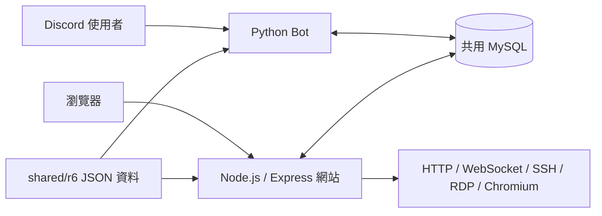

# LiuLianBot 功能運作導覽

本文件依據本機版本 `bf2875a` 的原始碼靜態探索整理。GitHub 存放庫為
[QEXLAUWASD/LiuLianBot](https://github.com/QEXLAUWASD/LiuLianBot)。
本次未啟動 Discord、MySQL 或遠端連線服務；以下描述程式實作，而非線上服務驗證結果。

## 整體架構

Bot 與網站分別執行，跨程式功能主要透過資料庫交換狀態。R6 地圖與幹員資料則來自共用 JSON 檔案。

## 啟動與指令處理

- Bot：`discord-part/main.py` 載入設定、建立 CommandHandler 與 MyClient，確認 token，建立資料庫並執行 migration，最後呼叫 `bot.run()`。
- `core/bot_client.py` 的 `setup_hook()` 註冊伺服器事件與 slash 指令；`on_ready()` 初始化私人語音管理、啟動公告派送並記錄伺服器及頻道資料。
- `commands/handler.py` 掃描各權限分類目錄的公開非同步函式，自動登錄指令。`core/command_processor.py` 負責解析名稱、權限檢查、執行及回覆；未預期錯誤會記錄參考碼。
- 前綴指令由 `on_message()` 進入；slash 指令經 `core/slash_adapter.py` 轉接至同一處理流程，參數規格來自 `tools/interaction_args.json`。
- 網站：`website-part/src/server.js` 初始化 MySQL pool 與 migration、建立 session store，再透過 `src/app.js` 組裝 Express 路由；開始監聽後掛上 WebSocket、SSH、RDP 與 Chromium 服務。

## 主要功能與閱讀入口

| 功能 | 運作方式 | 原始碼入口 |
|---|---|---|
| R6 抽選 | 從共用資料讀取地圖或幹員；網站可按攻守方選擇候選幹員，再隨機抽取裝備 | `discord-part/features/r6_roll/`、`website-part/src/routes/roller.js`、`shared/r6/` |
| 私人語音 | 加入觸發頻道後建立或重用個人頻道；離開時檢查是否可刪除，另有背景清理 | `discord-part/features/private_voice_chat/private_voice.py` |
| 伺服器記錄 | 註冊訊息、語音、成員、頻道、身份組及伺服器事件，輸出至設定的記錄頻道 | `discord-part/features/server_logger/` |
| 自助身份組 | 使用指令操作伺服器設定的可自行領取身份組 | `discord-part/commands/user/role.py`、`discord-part/features/self_roles/` |
| 帳號與權限 | 網站 session 保存在 MySQL；API、管理頁與遠端功能分別套用中介層檢查 | `website-part/src/routes/auth.js`、`website-part/src/middleware/` |
| 活動與報名 | 網站路由檢查登入、活動可見性及建立權限；兩端 repository 操作共用活動資料 | `website-part/src/routes/events.js`、`website-part/src/db/events.js`、`discord-part/features/events/repository.py` |
| 排程公告 | Bot 每 15 秒查詢並認領到期公告，送至 Discord 後標記完成，失敗則釋放認領 | `discord-part/features/announcements/dispatcher.py` |
| 網站連線代理 | `/connect/:slug` 代理 HTTP，另掛載 WebSocket 代理並使用 session 驗證 | `website-part/src/routes/connection_proxy.js` |
| 遠端工具 | SSH 終端、WebRDP、Chromium 各有伺服器模組；設定檔與 VLESS 合併工具透過各自路由提供 | `website-part/src/ssh_server.js`、`rdp_socket.js`、`chromium_server.js`、`routes/vless_tunnel.js` |

## 跨程式流程範例

### 網站調整私人語音觸發頻道

1. 網站帳號先連結 Discord 身分。
2. `routes/guild_manager.js` 依連結的 Discord ID 查詢可管理伺服器，透過資料庫層更新設定。
3. Bot 在收到加入語音頻道事件時，重新查詢該伺服器的觸發頻道。
4. 若加入的是觸發頻道，則建立或重用私人頻道並移動成員。因此這項網站設定不必重啟 Bot 即可生效。

### Discord 與網站共用活動身分

1. 使用者在網站 Account 頁面產生一次性連結碼，路由位於 `routes/account.js`，掛在 `/api/auth` 下。
2. Discord 使用 `>link <code>`；指令驗證八位十六進位代碼，再由 `EventRepository.link_account()` 綁定 Discord 使用者 ID。
3. 活動功能透過共用資料庫中的身分關係處理報名。網站建立活動另需管理員權限與已連結的 Discord 帳號。

## 維護時應留意

- 空資料庫第一次部署需先啟動網站，因 Bot migration 會修改網站 migration 建立的 `website_announcements` 表。
- 網站資料存取實作集中在 `src/db/`；`src/db.js` 保留相容匯出。修改共用表時，要一起檢查 Python 與 JavaScript 的 repository 及 migration。
- 頁面顯示限制、API 授權與遠端連線權限是不同檢查點，應分別追蹤各路由與中介層。
- 現有測試位於 `discord-part/tests/` 與 `website-part/test/`；Python 使用 pytest，網站使用 `npm run check`（JavaScript 語法檢查與 Node 測試）。本次僅修改文件，未執行服務整合測試。
